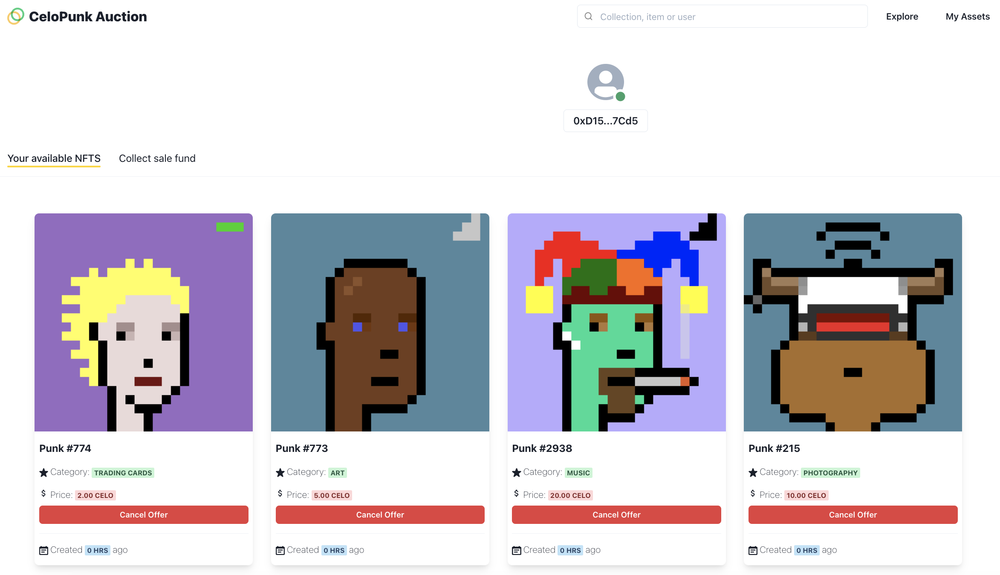
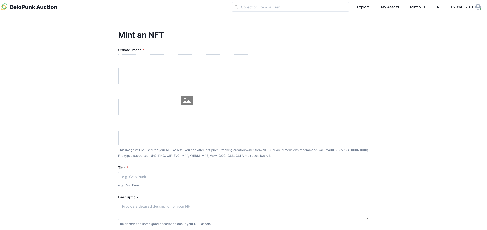
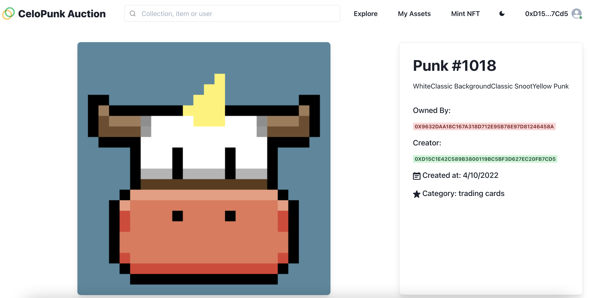

# CeloPunk auction

## Overview

CeloPunk is a NFT marketplace on celo testnet chain (Alfajores). It allows user mint, buying, make an offer, claim funds of NFTs in an automated environment.  
The demo from challenge Dacade courses "Celo Development 201: [https://dacade.org/communities/celo/courses/celo-201/challenges/df5bfad4-7af3-4fd6-9351-ed6d9f45ac4b] - Dacade 
- [Demo Website](http://celopunk-auction.vercel.app/). 

You can signup here to learn and earn crypto: https://dacade.org/signup?invite=anhfellow

## Technology stack

- `Solidity`
- `Next.js`
- `Hardhat`
- `celodapp kit`
- `Metamask`
- `IPFS`
- `ChakraUI`

## Contracts

- NFTCollection - 0x438cd380130f848E59B163c345d04A67F346649d
- NFTMarketplace - 0x9632Daa18c167a318D712E95b78E97d81246458a

## Features

1. Mint NFT straight from NFTCollection contract. User must input a name, description and upload a file (image, gif, video) to mint his own NFT 
2. User can make an offer his NFT by specifying its price. If someone fulfills this offer, then the NFT ownership is transferred to a new owner. 
3. User can cancel an offer he did in the past if in the end he does not want to sell his NFT or wants to adjust the price.
4. User can buy those NFT which someone else offered for sale in the marketplace.
5. If user sold an NFT, he can claim his funds go to "My assets" page and click on tab "collect sale fund".  
6. NFT can track owner, creator address.  

## Screenshots

- **Home Page**
  
- **Explore NFT**
  
- **My assets/Collect sale fund**
  
- **Mint NFT**
  
- **NFT Details**
  
  
## Installing
 
First you need to copy .env.example to .env and fill in your private key.

Run the following command in your terminal after cloning the main repo:

```
npx hardhat run scripts/deploy.js --network alfajores
yarn
yarn build
yarn dev
yarn start
```
